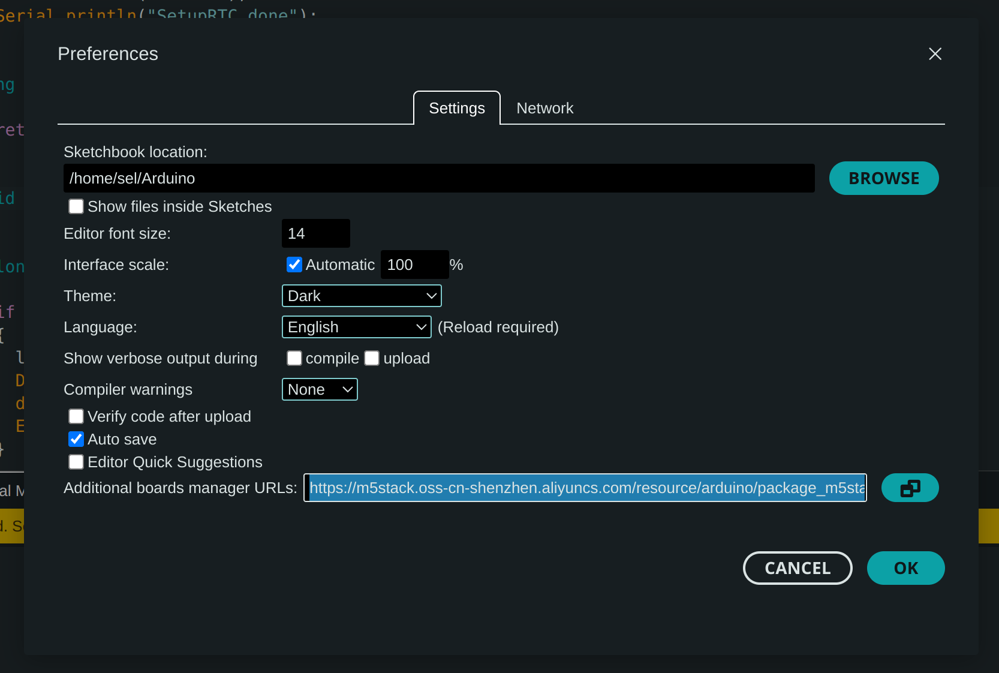
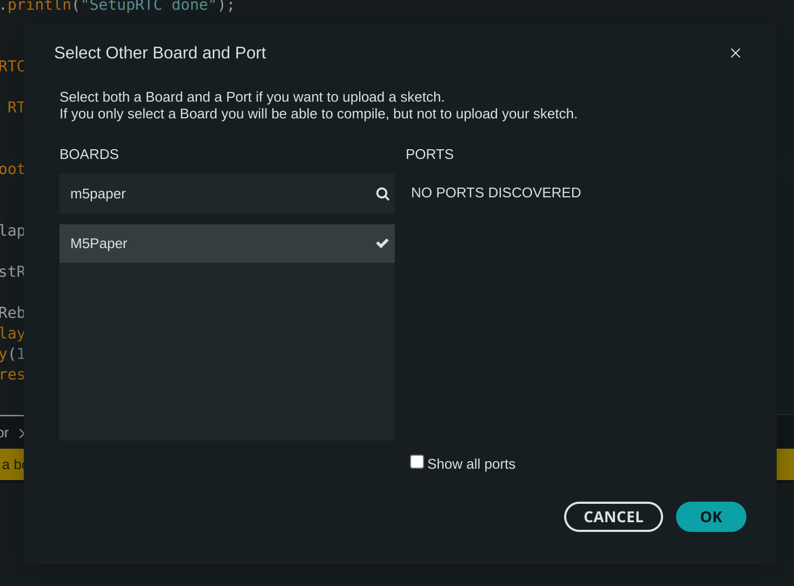
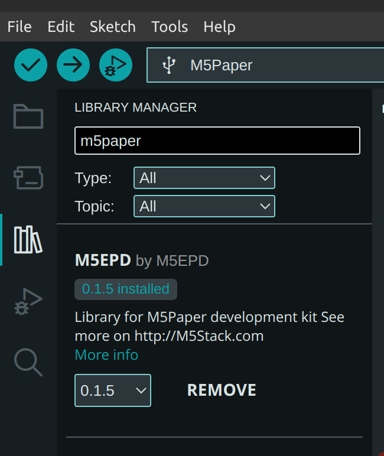

# ePaper meetingromm display

This repository contains the source code of the ePaper meetinroom display that allows to display:

- the availability of the room;
- the information (e.g. meeting name, organizer, start time, end time, etc.) about the meeting (if booked);
- air quality information (temperature, humidity and CO2 level).

Moreover the display allows, in case the room is free, to book the room fro the next 15, 30 or 60 minutes.

# IoT device

The device is an IoT ePaper touch device, with resolution 960x540 pixel.\
The on-board microcontroller is an 240MHz dual core ESP32-V3.

[M5Paper device](https://shop.m5stack.com/products/m5paper-esp32-development-kit-960x540-4-7-eink-display-235-ppi?variant=37595977908396)

# How it works

The core #2 is used to read the data trom the backend (a REST Web API) and used a trivial authentication: an additional HTTP header **label-id** containing the MAC address of the WiFi of the IoT device.\
On backend side, a match between the Room and the IoT devices MAC addresses is performed.

The label reads bothe the data about the air quality, and the room (general info and events).

The core #1 is responsible of the UI and of the touch events.

A comlete log is sent to the Serial port

# Compile the code with Arduino.

Please install the last Arduino IDE.\
Download libraries and products for the M5Stack devices:
https://m5stack.oss-cn-shenzhen.aliyuncs.com/resource/arduino/package_m5stack_index.json

And set the IDE to use the M5Paper board

Install the needed libraries

# To know

If the IoT is not able to connect to the WiFi after some seconds, it reboots (check SSID and password)

In order to refresh the ePaper, the label restarts every 2 hours

# To improve

Sadly I didn't find a good way to avoid the ghosting effect, see https://community.m5stack.com/topic/5960/doorsignage-with-m5paper-how-avoid-the-ghosting
